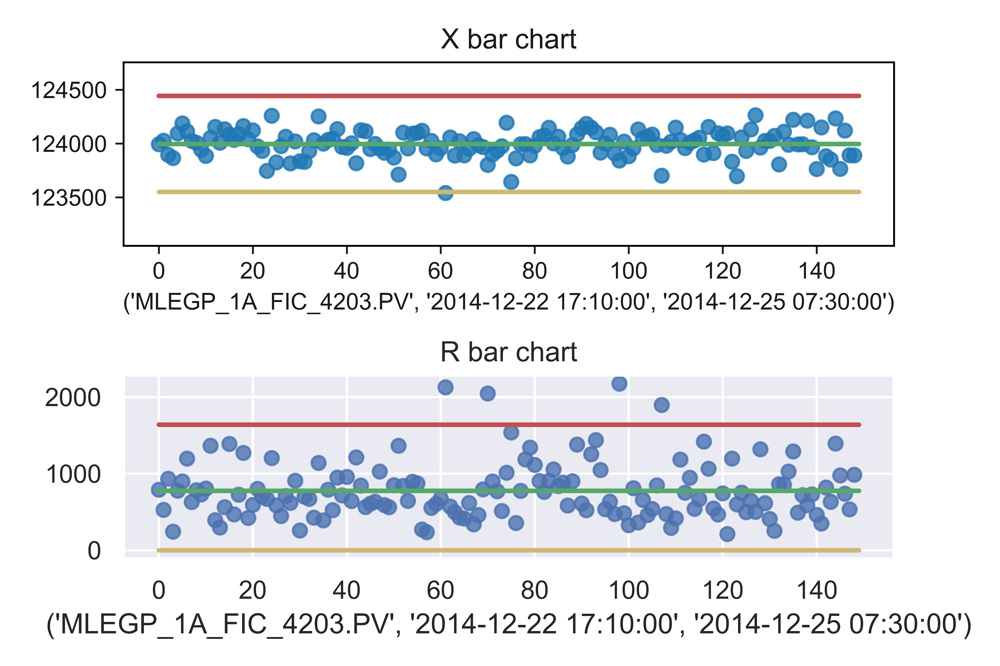
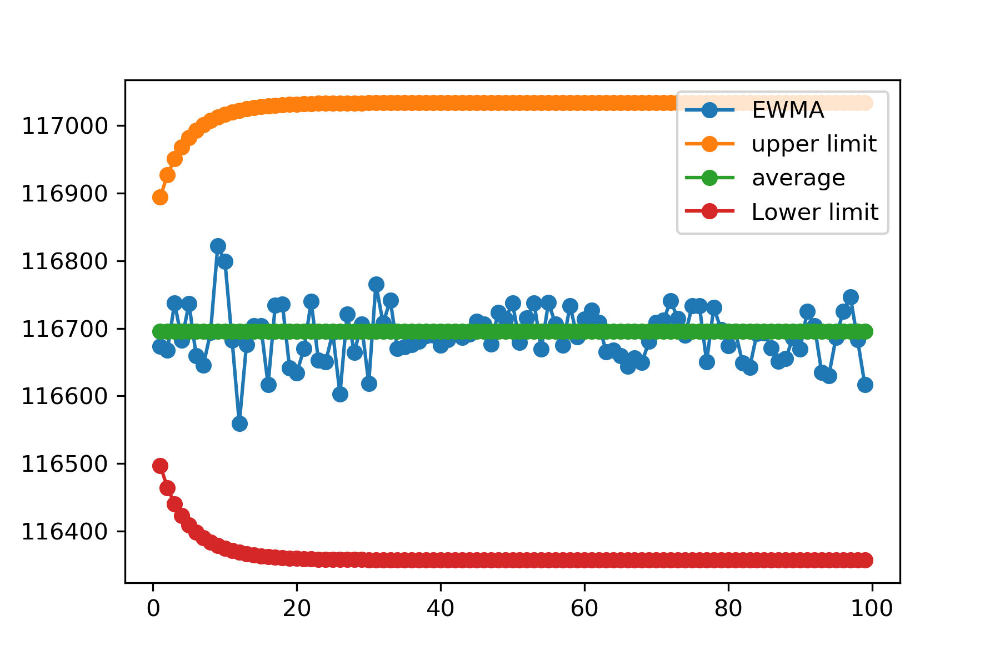

## SPC-Chart-
### According to ASQ: 
"Statistical process control (SPC) or the control chart is a graph used to study how a process changes over time. Data are plotted in time order. A control chart always has a central line for the average, an upper line for the upper control limit and a lower line for the lower control limit. These lines are determined from historical data. By comparing current data to these lines, you can draw conclusions about whether the process variation is consistent (in control) or is unpredictable (out of control, affected by special causes of variation)." The SPC chart looks like this: 

## EWMA Control Chart-
### According to the Engineering stastics handbook:  
"The Exponentially Weighted Moving Average (EWMA) is a statistic for monitoring the process that averages the data in a way that gives less and less weight to data as they are further removed in time."[1]

### Reference:

[1]. https://www.itl.nist.gov/div898/handbook/pmc/section3/pmc324.htm
